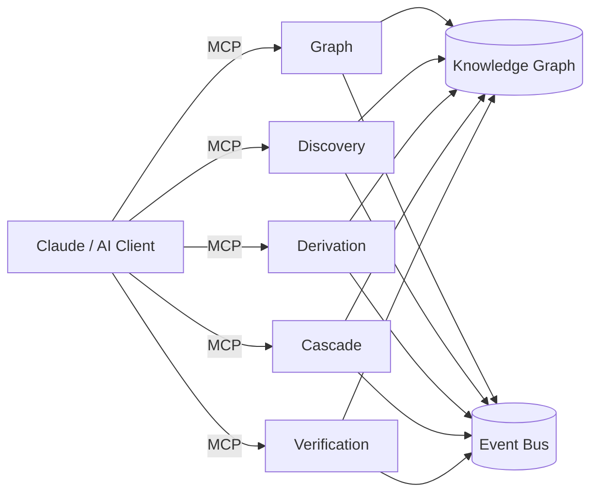

# API Reference

Helix exposes **28 tools** across 5 federated MCP servers. All APIs are defined using MDSL (Microservice Domain-Specific Language) contracts that compile to OpenAPI and AsyncAPI specifications.

## API Architecture



## MCP Servers

| Server | Tools | Description |
|--------|-------|-------------|
| [Graph Core](graph.md) | 4 | Knowledge Graph source of truth |
| [Discovery](discovery.md) | 4 | Persona ecosystem discovery |
| [Derivation](derivation.md) | 5 | Requirements engineering |
| [Cascade](cascade.md) | 7 | 12-layer artifact generation |
| [Verification](verification.md) | 8 | Drift detection, SMT proofs |

## Tool Naming Convention

All tools follow the pattern: `cpe/{action}_{noun}`

Examples:
- `cpe/query_graph`
- `cpe/discover_personas`
- `cpe/submit_requirement`
- `cpe/generate_artifact`
- `cpe/verify_drift`

## Authentication

All tools require a `tenant_id` parameter for multi-tenant isolation:

```json
{
  "tenant_id": "my-tenant-123",
  // ... other parameters
}
```

## Response Format

All tools return JSON with this structure:

=== "Success"
    ```json
    {
      "success": true,
      "message": "Operation completed",
      // ... tool-specific data
    }
    ```

=== "Error"
    ```json
    {
      "success": false,
      "error": "Error description"
    }
    ```

## Generated Specifications

The MDSL contracts compile to:

- **OpenAPI 3.0**: `/docs/generated/openapi-merged.yaml`
- **AsyncAPI 2.0**: `/docs/generated/asyncapi-merged.yaml`

Run `pnpm run compile:mdsl` to regenerate specifications.

## Interactive Documentation

- [Swagger UI](swagger.md) - Interactive API explorer
- [Events Reference](events.md) - AsyncAPI event documentation

## MDSL Contract Locations

| Package | MDSL File |
|---------|-----------|
| mcp-graph | `packages/mcp-graph/src/api/graph-api.mdsl` |
| mcp-discovery | `packages/mcp-discovery/src/api/discovery-api.mdsl` |
| mcp-derivation | `packages/mcp-derivation/src/api/derivation-api.mdsl` |
| mcp-cascade | `packages/mcp-cascade/src/api/cascade-api.mdsl` |
| mcp-verification | `packages/mcp-verification/src/api/verification-api.mdsl` |
