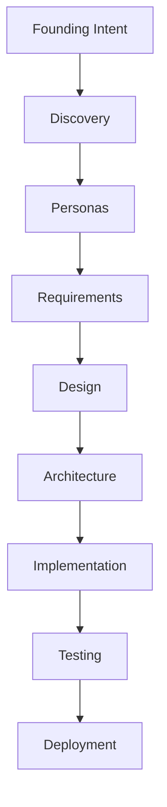

# Helix Documentation

Welcome to **Helix** - a federated MCP server implementation of the **Cascading Persona Ecosystem** architecture.

## What is Helix?

Helix transforms a single "Founding Intent" into a complete, traceable, multi-tenant software system through automated persona discovery, requirements derivation, and artifact generation.



## Key Features

- **12-Layer Cascade**: Systematic artifact generation from persona to deployment
- **Discovery Triad**: CoT + MAD + OG-RAG for comprehensive persona discovery
- **Human Gates**: 4 mandatory approval checkpoints for governance
- **Full Traceability**: Every artifact links back to the Founding Intent
- **Formal Verification**: SMT proofs via Z3 for security policies
- **Multi-tenant**: Built-in RLS and tenant isolation

## Quick Start

```bash
# Install dependencies
pnpm install

# Start infrastructure
docker-compose -f docker-compose.dev.yml up -d

# Initialize database
pnpm run db:init

# Start all MCP servers
pnpm run start
```

## Architecture Overview

Helix consists of **5 federated MCP servers** plus the **Claude Worker** for code execution:

| Server | Purpose |
|--------|---------|
| **Graph Core** | Knowledge Graph source of truth |
| **Discovery** | Persona ecosystem discovery |
| **Derivation** | Requirements engineering |
| **Cascade** | 12-layer artifact generation |
| **Verification** | Drift detection, SMT proofs |
| **Claude Worker** | Long-running code execution (Anthropic Harness) |

## Documentation

### Getting Started

- [Installation](getting-started/installation.md) - Installation and setup
- [Configuration](getting-started/configuration.md) - Configuration options and environment variables
- [Quick Start](getting-started/quick-start.md) - Your first Helix workflow

### Architecture

- [Overview](architecture/overview.md) - System design and concepts
- [MCP Servers](architecture/mcp-servers.md) - The 5 federated MCP servers
- [Knowledge Graph](architecture/knowledge-graph.md) - Neo4j schema and queries
- [12-Layer Cascade](architecture/layers.md) - Artifact generation layers

### Guides

- [Persona Discovery](guides/persona-discovery.md) - Discovering personas from Founding Intent
- [Requirements Derivation](guides/requirements-derivation.md) - Engineering requirements
- [Claude Worker](guides/claude-worker.md) - Long-running code execution harness
- [Frontend Implementation](guides/frontend-implementation.md) - shadcn/ui integration and E2E verification

### Integration

- [Orchestration](guides/orchestration.md) - Orchestrator and Claude Worker setup
- [External MCP Servers](external-mcp-servers.md) - shadcn, Puppeteer, and Playwright configuration

### API Reference

- [API Reference](api/index.md) - Complete tool documentation

## API Documentation

API contracts are defined using **MDSL** (Microservice Domain-Specific Language) and compiled to:

- **OpenAPI 3.0** for REST API documentation
- **AsyncAPI 2.0** for event-driven API documentation
- **Swagger UI** for interactive exploration

See [API Reference](api/index.md) for the complete API documentation.
